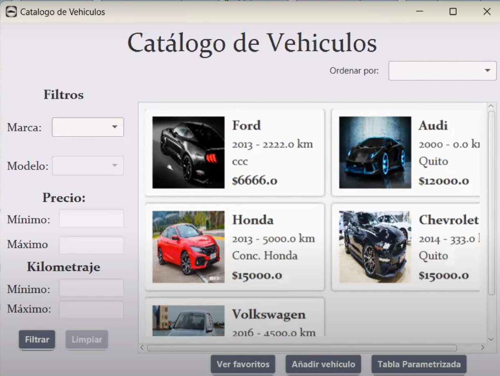
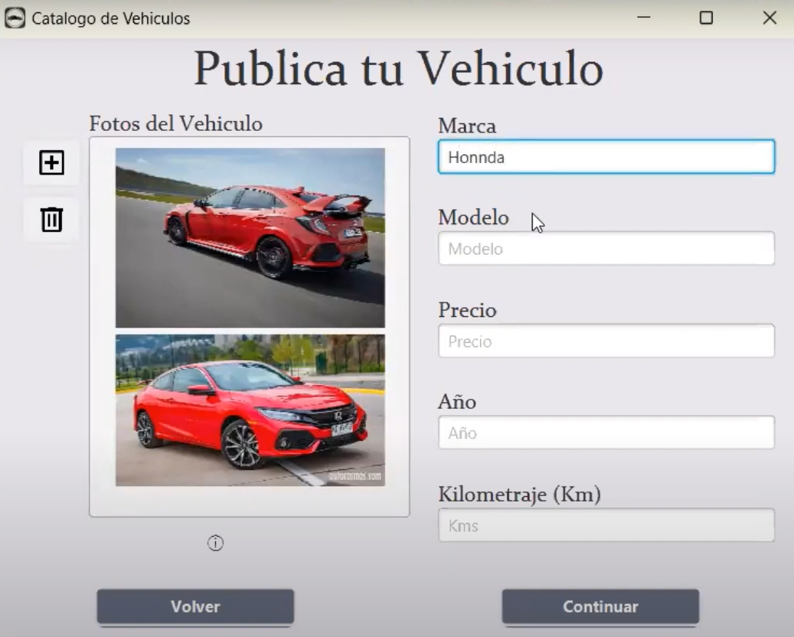
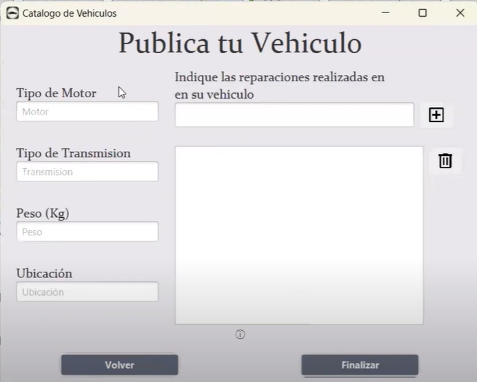

# 💻 Mi Portafolio de Proyectos

¡Bienvenido a mi repositorio personal! Aquí encontrarás una recopilación de mis proyectos más relevantes, incluyendo descripciones, tecnologías utilizadas, estado de desarrollo, enlaces y más.

---

## 👤 Información Personal

- **Nombre:** Hilda Victoria Angulo Borja
- **Carrera:** Ingeniería en Computación (6to Semestre)
- **Colegio:** Academia Naval Almirante Illingworth
- **Universidad:** Escuela Superior Politécnica del Litoral  
- **País:** ꭼꮯ Ecuador  
- **Idiomas:** Español (nativo), Inglés (intermedio/nivel B2)  
- **Intereses:** Desarrollo web, inteligencia artificial, diseño UI/UX, automatización  
- **Hobbies:** Programar, videojuegos, resolver retos

---

## 📌 Índice

- [Proyectos](#proyectos)
- [Tecnologías Utilizadas](#tecnologías-utilizadas)
- [Contacto](#contacto)

---

## 🚀 Proyectos Destacados

### 1. **Inventario de Vehículos**
**Descripción:** Proyecto web desarrollado como parte de la materia Estructuras de Datos, enfocado en la gestión y visualización de un inventario de vehículos disponibles para la venta. La plataforma permite registrar, consultar y organizar información de automóviles, facilitando su administración mediante estructuras de datos eficientes.    
**Estado:** ✅ Completado.  
**Tecnologías:** `Java` `NetBeans` `SceneBuilder`  
**Repositorio:** [Link to GitHub Repository](https://github.com/Alvasconv/Grupo-11)  
**Captura de pantalla:**

---

### 2. **Sistema de servicios de taxi o encomiendas**
**Descripción:** Este proyecto consiste en una aplicación de consola diseñada para ofrecer servicios personalizados de transporte de pasajeros y envío de encomiendas. El sistema permite al usuario seleccionar el tipo de servicio deseado y calcula el costo en función de la distancia recorrida. Su enfoque principal es brindar una solución práctica y eficiente para la gestión de solicitudes de transporte local, integrando una lógica sencilla de tarifas y opciones adaptadas a las necesidades del cliente. Proyecto realizado para la materia programación orientada a objetos.  
**Estado:** ✅ Finalizado.    
**Tecnologías:** `Java` `Apache NetBeans`  
**Repositorio:** [Link to BitBucket Repository](https://bitbucket.org/poo5-1p-g1/bitbucket-poo-grupo1/src/master/)    
**Captura de pantalla:**

---

### 3. **Sistema de viajes**
**Descripción:** El presente proyecto consiste en el desarrollo de un sistema de gestión de viajes aéreos implementado en Java utilizando el entorno de desarrollo NetBeans. La aplicación permite a los usuarios registrarse e iniciar sesión para acceder a una plataforma interactiva donde pueden consultar horarios de vuelos, visualizar destinos turísticos mediante un mapa, y realizar reservas de vuelos. Además, el sistema ofrece promociones mensuales y una interfaz gráfica amigable orientada a mejorar la experiencia del usuario en la planificación de sus viajes. Proyecto realizado para la materia programación orientada a objetos.
**Estado:** ✅ Finalizado.  
**Tecnologías:** `Java` `Apache NetBeans` `SceneBuilder`
**Repositorio:** [Link to GitHub Repository](https://github.com/vic28code/PAR5_PROY2P_Angulo_Herrera_Moscoso)    
**Captura de pantalla:**

---

## 🛠 Tecnologías Utilizadas

A lo largo de mis proyectos he utilizado diferentes herramientas y lenguajes:

- **🖥️ Lenguajes de Programación:** `Java` `SQL`   
- **🧰 Entornos de Desarrollo y Herramientas:** `NetBeans` `Scene Builder` `Git` `GitHub` `Bitbucket` 
- **🗃️ Base de datos:** `MySQL` `SQLite`
- **🎨 Diseño de Interfaces:** `JavaFX` `Scene Builder`
- **📚 Frameworks y Librerías:** `JavaFX` (para GUI)  

---

## 📬 Contacto

Si deseas ponerte en contacto conmigo:

- 📧 Correo institucional: [hvangulo@espol.edu.ec](mailto:hvangulo@espol.edu.ec)
- 💼 LinkedIn[linkedin.com/in/victoria-angulo-860a51252/](https://linkedin.com/in/victoria-angulo-860a51252/)
- 🐙 GitHub [github.com/vic28code](https://github.com/vic28code)  
- _Enlace página web: https://vic28code.github.io/Vic/_

---

_Última actualización: mayo 2025_
